# Instalación de Git en linux
## Indice
- **[Instalación Predeterminada](#instalación-predeterminada)**
- **[Instalación desde la fuente](#instalación-desde-la-fuente)**
- **[Configuración de Git](#configuración-de-git)**
### Instalación Predeterminada
Para comenzar con esta actividad, primero veremos si nuestra máquina virtual Ubuntu tiene instalado el git. Para ello usaremos el comando **“git --version”**.

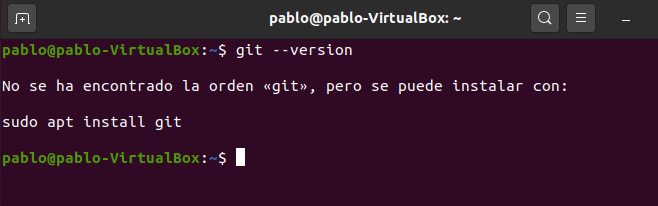

En este caso, al no estar instalado deberemos instalarlo, primero realizaremos el update del sistema con **“sudo apt update”**.

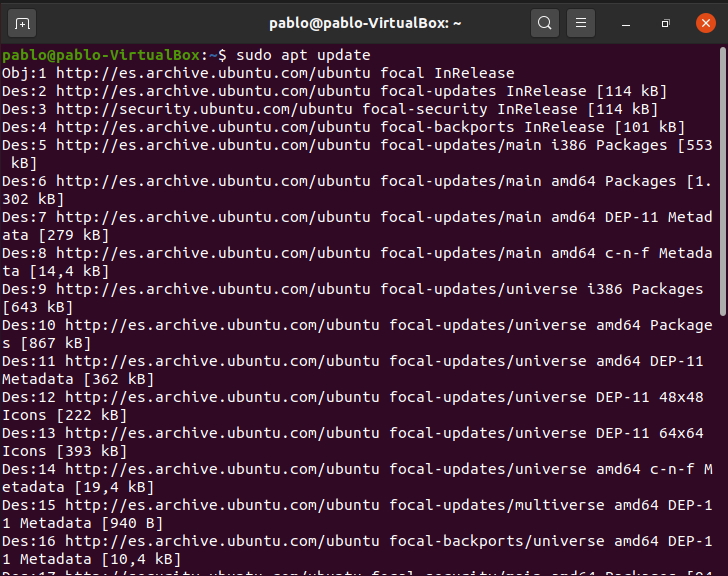

Tras realizar el update comenzaremos con la instalación con el comando **“sudo apt install git”**.

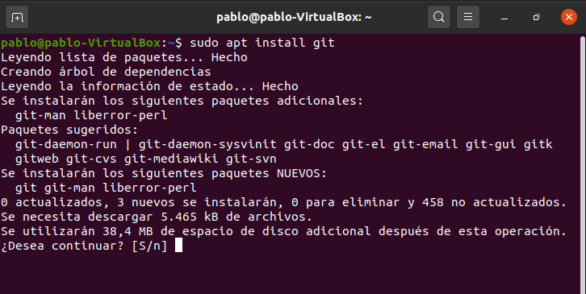

Al finalizar la instalación comprobamos que se instaló correctamente con el comando **“git --version”**.

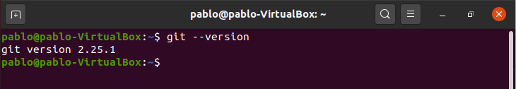

### Instalación desde la fuente 
A continuación, verificaremos la versión de git que hemos instalado anteriormente. Sabemos que es la versión 2.25.1, pero descargamos una versión específica, esta versión será la 2.29.3. Para comenzar realizaremos un update con el comando **“sudo apt update”**. Ahora descargamos las dependencias necesarias para la instalación con el comando **”sudo apt install libz-dev libssl-dev libcurl4-gnutls-dev libexpat1-dev gettext cmake gcc”**.

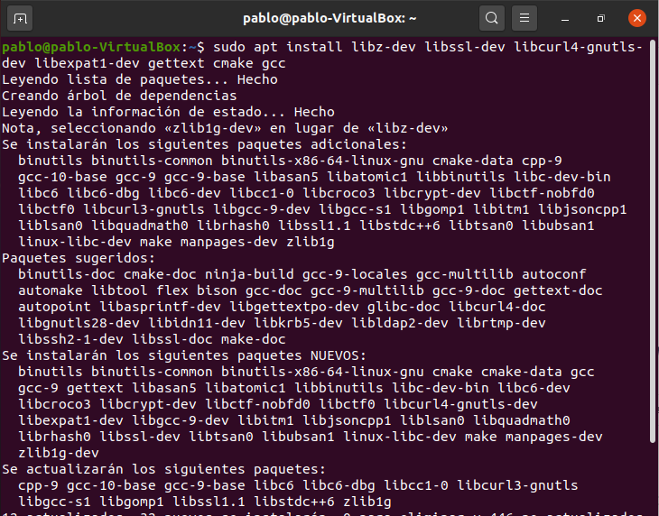

Tras la descarga crearemos un directorio y nos posicionamos en él. Esto lo haremos con los siguientes comandos. Para la creación del directorio usaremos **“mkdir tmp”** y para ir al directorio usaremos **“cd /tmp”**.

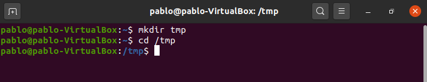

Ahora descargamos la versión que queramos desde el sitio web del proyecto Git. Para esto usaremos el comando curl y lo enviamos a git.tar.gz. Usaremos el siguiente comando **“curl -o git.tar.gz https://mirrors.edge.kernel.org/pub/software/scm/git/git-2.29.3.tar.gz”**.

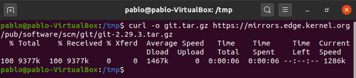

Descomprimimos el archivo que recientemente hemos descargado con el comando **“tar -zxf git.tar.gz”**.

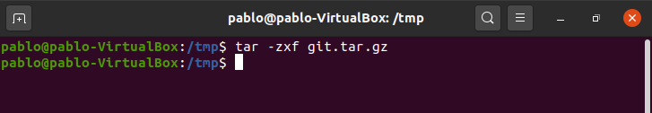

Tras esto accedemos al nuevo directorio de git con el siguiente comando **“cd git-*”**.

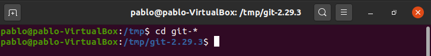

A continuación, creamos el paquete y lo instalamos. Para crear el paquete usamos el comando **“make prefix=/usr/local all”**, y ,para instalar ese paquete, usamos **“sudo make prefix=/usr/local install”**.

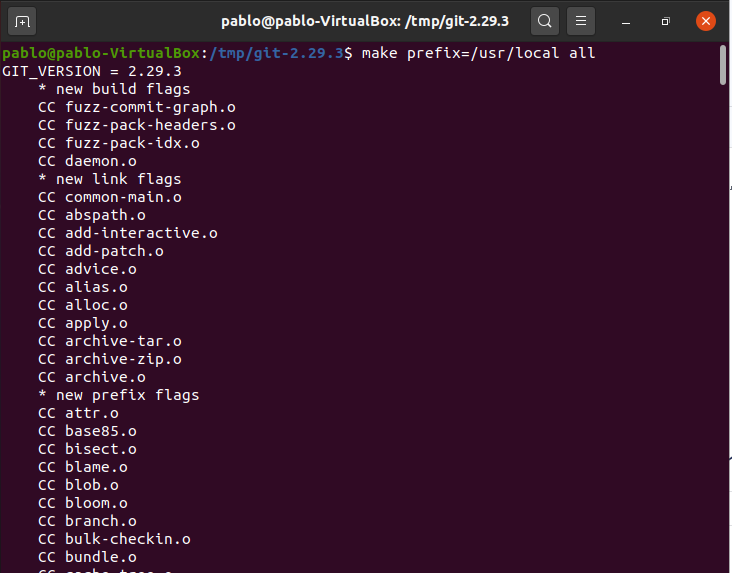

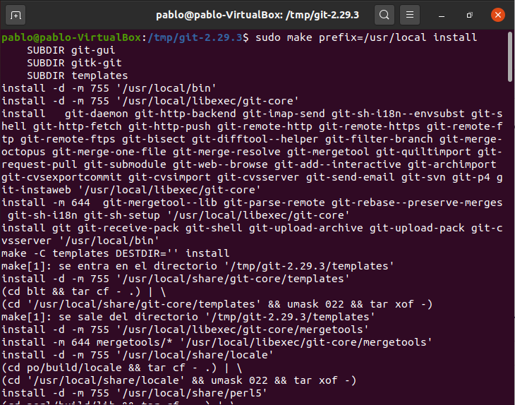

Finalmente cambiamos el proceso de shell para que se comience a utilizar la nueva versión de git con el comando **“exec bash”**.

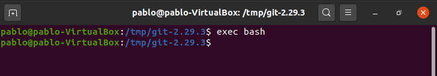

Ya a modo de comprobación usaremos el comando **“git --version”** para ver que se nos ha instalado la nueva versión.

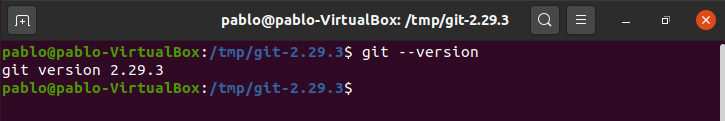

### Configuración de Git

Ya teniendo git instalado podemos realizar su configuración, para realizar la configuracion pondremos el nombre y el correo con los siguientes comandos **“git config --global user.name "Your Name"”** y **“git config --global user.email "youremail@domain.com"”**.

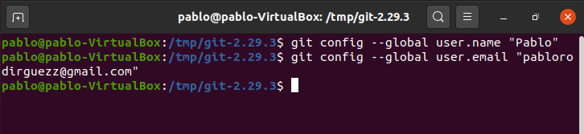

Si queremos ver los datos que hemos creado tendremos que usar el comando **“git config --list”**.

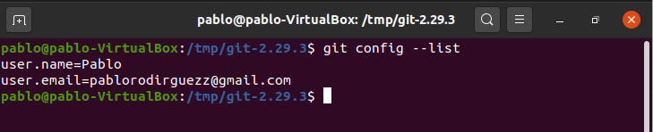

Esta información se guardará en el archivo gitconfig el cual podremos ver y editar con el comando **“nano ~/.gitconfig”**.

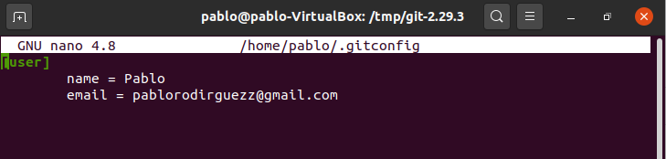
